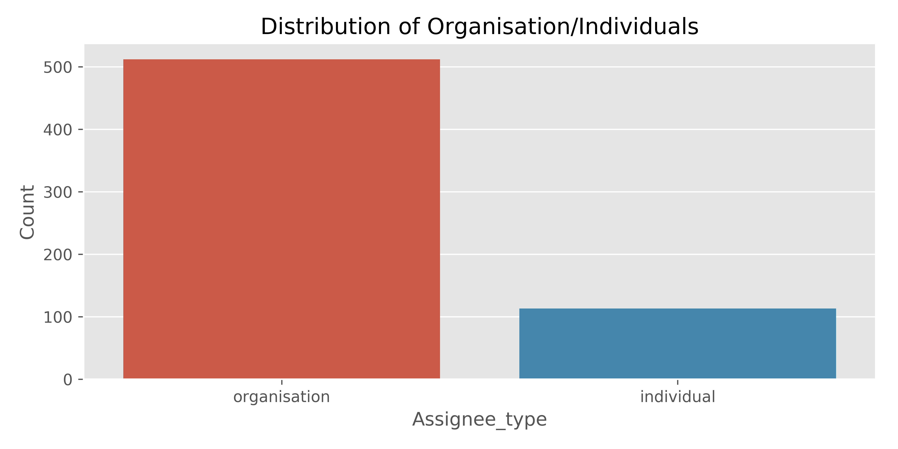
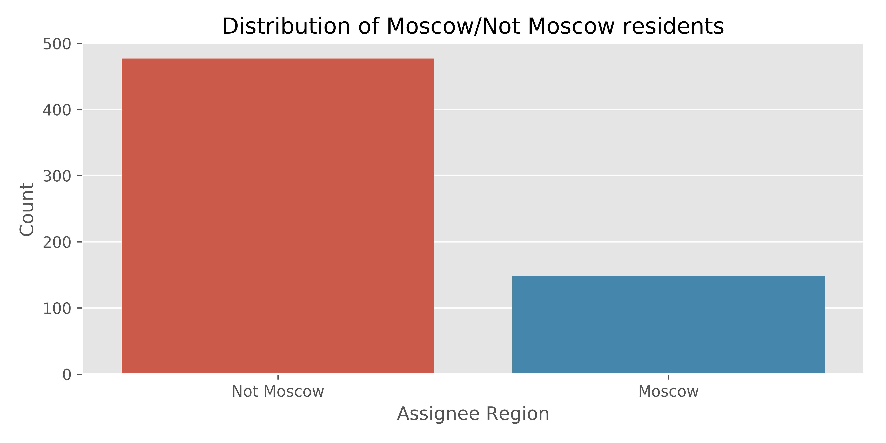

# Отчёт по анализу патентной активности юридических и физических лиц России

## Summary:

> Для анализа даны **$328$** патентных заявки (Patent applications), поданных $625$ **резидентами России** **в иностранные патентные офисы** с период **с $1$ января $2017$ года по $31$ декабря $2017$ года**. 
> - **Юридически**, данные включают как патентные заявки физических лиц, ИП (individual, $113$ или $0.18$ правообладателей), так и патентные заявки предприятий (organizations, $512$ или $0.82$ правообладателей).  
> <sup>* Цифры учётом совместной подачи заявки несколькими компаниями одного холдинга.</sup>

> - **Географически**, правообладатели патентных заявок распределены неравномерно распределены. В Москве ($148$ или $0.24$ правообладателей, с учётом правообладателей, чьи дочерние предприятия зарегистрированы за пределами РФ, но имеют права на патент) и за её пределами ($477$ или $0.76$ правообладателей)\*.  
> <sup>* Подробный анализ в срезе каждого региона возможен при дополнительном выделении средств на разметку данных и продолжение анализа.</sup>

** Распределение правообладателей по типу individual or organisation**:


**Топ-4 авторы заявок среди организаций ($0.47\%$ заявок от организаций)**

| Автор заявки                                  | Количество заявок |
|----------------------------------------------------------------|---------------------|
| Лаборатория Касперского                                        | 121                 |
| INTEL                                                          | 50                  |
| Яндекс                                                         | 51                  |
| ABBYY                                                          | 18                  |

**Топ-4 авторы заявок среди individuals ($0.16\%$ заявок от individuals)**

| Автор заявки           | Количество заявок |
|---------------------------|-------------------|
| ШТОРМ АЛЕКСЕЙ ВИКТОРОВИЧ  | 10                |
| ШИЛОВ ВИКТОР ПЕТРОВИЧ     | 4                 |
| УШАКОВ АЛЕКСЕЙ ЛЕОНИДОВИЧ | 2                 |
| ВАРЮХИН МАКСИМ АНТОНОВИЧ  | 2                 |

**Алгоритм определения:**  
распознавание именованных сущностей и ручная обработка сложных случаев.

** Распределение правообладателей по региону**:


**Алгоритм обработки:**  
(переход к следующему пункту если качество работы предыдущего не устраивает):  

_Предобработка:_
0. Перевод транслитного написания в кирилическое  

_Поиск:_
0. Ручная обработка крупных Assignees по названиям холдинга или ФИО.
1. Проверим наличие субъекта Current assignees в известной базе (Assignee address).
2. Обращение к _открытым_ источникам (в порядке убывания приоритета): 
    * открытые реестры, налоговые базы, базы проверки контрагентов, базы организаций 
        - [\[1\]](https://egrul.nalog.ru/index.html) 
        [\[2\]](http://zakupki.gov.ru/epz/organization/quicksearch/search.html?searchString=%D0%9A%D0%B0%D1%81%D0%BF%D0%B5%D1%80%D1%81%D0%BA%D0%BE%D0%B3%D0%BE&morphology=on&pageNumber=1&sortDirection=true&recordsPerPage=_10&sortBy=PO_NAZVANIYU&fz94=on&fz223=on&regionDeleted=false) 
        [\[3\]](http://online.igk-group.ru/ru/home?name=%D0%90%D0%9E+%22+%D0%9B%D0%90%D0%91%D0%9E%D0%A0%D0%90%D0%A2%D0%9E%D0%A0%D0%98%D0%AF+%D0%9A%D0%90%D0%A1%D0%9F%D0%95%D0%A0%D0%A1%D0%9A%D0%9E%D0%93%D0%9E&ogrn=&inn=) 
        [\[4\]](https://www.list-org.com/) 
        [\[5\]](https://www.kartoteka.ru/) 
        [\[6\]](https://zachestnyibiznes.ru/) 
        [\[7\]](https://sbis.ru/) 
        [\[8\]](https://nalog.io/), 
    * базы патентов, базы конкурсов на финансирование 
        - [\[1\]](http://www.findpatent.ru/) 
        [\[2\]](https://patentdb.ru/) [\[3\]](https://4science.ru/), 
    * обращение к gis сервисам 
        - [\[1\]](https://2gis.ru/), 
    * ручной поиск.

## База PATSTAT

Так как Orbit не раскрывает свои правила выделения кодов под Technology domain [1](https://static.orbit.com/orbit/help/1.9.8/en/index.html#!Documents/technologydomain.htm), попробуем выделить их сделав несколько случайных выборок по 1000 с заданными Technology domain и конкатенировать все уникальные.  
В качестве запроса к PATSTAT используем ([\[1\]](https://forums.epo.org/coding-with-boolean-operators-for-ipc-codes-5542) [\[2\]](https://forums.epo.org/count-patent-based-on-assignee-country-7832)):
```SQL
SELECT DISTINCT a.*
FROM tls201_appln a
JOIN tls209_appln_ipc i ON a.appln_id = i.appln_id
JOIN tls207_pers_appln pa on a.appln_id = pa.appln_id
JOIN tls206_person p on pa.person_id = p.person_id
WHERE
(left (ipc_class_symbol, 4) IN ('H01B', 'F21S', 'C25D', 'H03L', 'H01S', 'H03G', 'F41H', 'H01G', 'G03B', 'E05B', 'B61B', 'B63G', 'H04B', 'G09C', 'B62D', 'B63C', 'H02S', 'F02B', 'H04R', 'G10K', 'G01T', 'G09B', 'G01C', 'G01D', 'F41F', 'A01G', 'H03F', 'E21B', 'F41G', 'B82B', 'G06T', 'C09D', 'H02J', 'G06F', 'C04B', 'G21H', 'B64C', 'H02B', 'E21F', 'H01R', 'H04M', 'B60Q', 'G01F', 'B60V', 'A61L', 'F42C', 'G11C', 'G08G', 'G01N', 'C08J', 'H03H', 'A01K', 'B29C', 'B23K', 'B64G', 'B60R', 'B64F', 'B82Y', 'B66B', 'G06E', 'G08B', 'A61P', 'G05B', 'C08L', 'F25B', 'E03C', 'B62B', 'G02F', 'B23H', 'B22F', 'A61B', 'C23C', 'B44F', 'C07F', 'F21V', 'B64B', 'A47F', 'F16G', 'A61K', 'H04W', 'G01W', 'H01L', 'C12Q', 'H04H', 'G08C', 'C30B', 'B60L', 'B61L', 'F25D', 'G01K', 'G07C', 'H01C', 'E04H', 'G06G', 'H04K', 'C01B', 'G21F', 'H04L', 'G05F', 'G02B', 'B60P', 'G03F', 'C22B', 'F28D', 'B61D', 'C05B', 'H02K', 'G10L', 'H02M', 'F16B', 'G12B', 'F24S', 'B25B', 'G01B', 'B65B', 'G05D', 'C22C', 'C07D', 'C03B', 'G01V', 'H03M', 'G07F', 'H01J', 'G01J', 'H03D', 'A61F', 'H01F', 'G06Q', 'H04Q', 'G06C', 'H03B', 'B65H', 'B23Q', 'E04G', 'G07B', 'B64D', 'G06K', 'G01H', 'F41A', 'C12N', 'F28F', 'B81B', 'H01P', 'H03C', 'E04D', 'A61C', 'G01M', 'B41M', 'H05B', 'G02C', 'F42B', 'H05K', 'H01Q', 'B33Y', 'G09G', 'H04N', 'G11B', 'G01R', 'C01F', 'H03K', 'G01L', 'G09F', 'A45C', 'H04J', 'G01S', 'G06N', 'H02H', 'B42D', 'G07D', 'C09K', 'H02N'))
AND appln_filing_year = 2017
AND appln_auth != 'RU' -- Fill to not Russian Office
AND person_ctry_code = 'RU'  -- applicant must be from Russia
AND appln_kind = 'A'  -- exclude PCT filings where the EPO only served as the Receiving Office
AND a.appln_id < 900000000   -- exclude artificial applications (see PATSTAT Data Catalog for details)
```

**Cхожесть данных из источников (Orbit, найдено 328 заявок и PATStAT, найдено 550 заявок):**    
_Ключ: Колонка_ ```Application number``` _для базы Orbit и колонка_ ```appln_nr_original``` _для базы PATSTAT:_

Пересекаются $27$ патентных заяков. Остальные патентные заявки по заданным полям при заданных условиях не одинаковы. Вероятная проблема в двух вещах: 
1. Неверно сделанный запрос к базе (не все коды technology domains из базы Orbit найдены).
2. Неверная обработка кодов заявок, которые в двух базах представлны по разному/с разными названиями.
